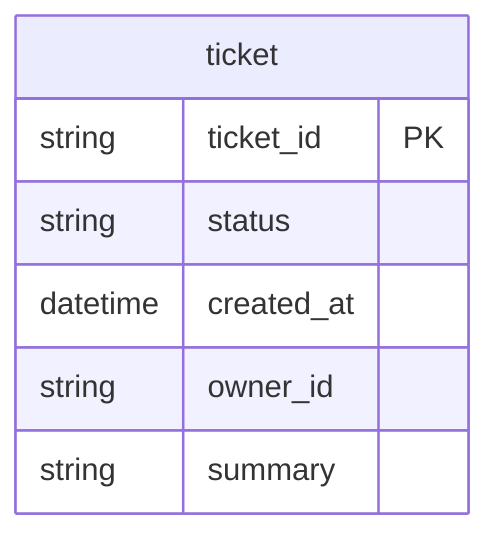
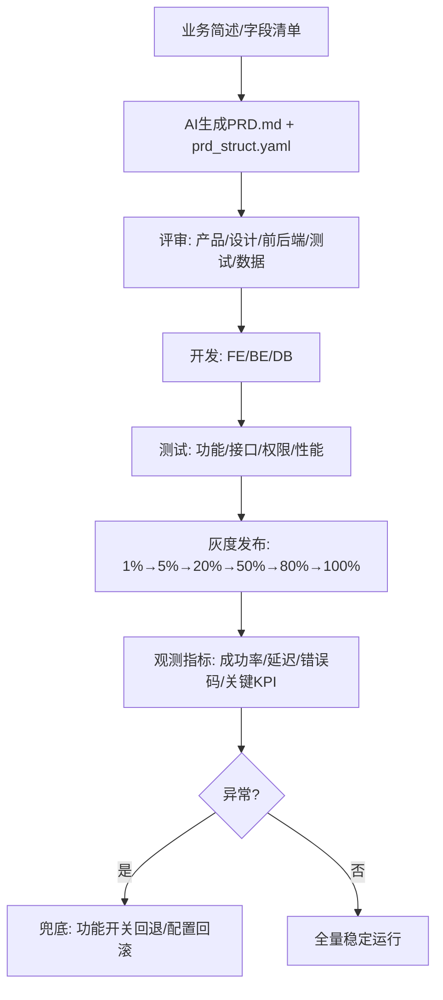

# 机器友好 PRD 格式、Prompt 模板与交付物

AI 工具输出“人类可读 Markdown + 机器可读 YAML/JSON”双轨内容；结构化输出可直接映射到 OpenAPI、JSON Schema 与 Mermaid。

## 何时使用

- 用 AI 从业务简述/字段清单生成 PRD 片段或完整包时。
- 需要统一机器可读 PRD 结构（prd_struct）、Prompt 模板或交付物清单时。

## PRD-Struct 必选字段

- meta：tier、product_type、module、version、owners（pm/design/fe/be/qa）
- storage_plan：root_path、package_name、naming_rule、package_mode（dir/single_file）
- goals：problem_statement、success_metrics（metric、definition、target、data_source）
- scope：in、out
- as_is_inventory：pages、apis、data_tables、permissions、telemetry（改造类需求必填）
- pages：page_id、name、entry、permissions、table、filters 等（与前端标注规范对齐；列表页必须含分页器字段）
- apis：api_id、method、path、authz、pagination、filter 等（与后端接口规范对齐）
- data_models：table、pk、indexes
- impact_matrix：impact_id、change_type、as_is、to_be、risk_level、gray_plan、rollback_plan
- change_strategy_gate：current_stage、strategy（replace/migrate/hybrid）、decision_reason、user_confirmation（改造类需求必填）
- reuse_assessment：existing_scan、build_vs_reuse、duplicate_risk、non_reuse_reason、consolidation_plan
- rollout_plan：dimensions、schedule、monitor_metrics
- rollback_plan：triggers、steps
- acceptance：criteria 列表

## 改造类需求：扩展字段模板（YAML）

```yaml
meta:
  tier: "small|medium|large"
as_is_inventory:
  pages: []
  apis: []
  data_tables: []
  permissions: []
  telemetry: []
impact_matrix:
  - impact_id: "IM-001"
    change_type: "ui|api|data|permission|telemetry"
    as_is: ""
    to_be: ""
    risk_level: "low|medium|high"
    affected_pages: []
    affected_apis: []
    affected_tables: []
    affected_permissions: []
    gray_plan: ""
    rollback_plan: ""
rollout_plan:
  dimensions: ["percentage|tenant|role|region|whitelist"]
  schedule: ["1%", "5%", "20%", "50%", "100%"]
  monitor_metrics: []
rollback_plan:
  triggers: []
  steps: []
```

## 新增：存储命名、改造策略确认、复用审查字段（YAML）

```yaml
storage_plan:
  root_path: "docs/prd"
  package_mode: "dir" # dir | single_file
  package_name: "20260217_01_order-rule-center"
  naming_rule:
    date_format: "YYYYMMDD"
    index_format: "2+ digits"
    slug_regex: "^[a-z0-9-]{1,32}$"
    slug_semantics: "2-5 words, business-specific, no new/final/v2"

change_strategy_gate:
  current_stage: "pre_production|production"
  strategy: "replace|migrate|hybrid"
  decision_reason: ""
  requires_user_confirmation: true
  user_confirmation:
    status: "pending|confirmed"
    confirmer: ""
    confirmed_at: ""
    notes: ""
  impact_summary:
    external_dependencies: []
    data_migration_irreversible: false
    rollback_time_objective: ""
    downtime_risk: "low|medium|high"

reuse_assessment:
  existing_scan:
    pages: []
    apis: []
    data_models: []
    permissions: []
  build_vs_reuse: "reuse|extend|new_build"
  duplicate_risk: "low|medium|high"
  non_reuse_reason: ""
  boundary_definition: ""
  consolidation_plan:
    needed: false
    actions: []
```

## 新增：列表页分页器字段（YAML）

```yaml
pages:
  - page_id: "PAGE_XXX_LIST"
    table:
      pagination:
        pagination_mode: "offset|token"
        page_size_default: 20
        page_size_options: [20, 50, 100]
        max_page_size: 200
        total_count_mode: "exact|estimated|unknown"
        controls:
          first_page: true
          prev_page: true
          next_page: true
          last_page: true
          jump_to_page: true
        reset_rule:
          on_filter_change: "reset_to_first_page"
          on_sort_change: "reset_to_first_page"
          on_search_change: "reset_to_first_page"
        consistency:
          primary_sort: "created_at desc"
          secondary_sort: "id desc"
          snapshot_pagination: false
        fallback:
          empty_page_after_delete: "fallback_to_prev_page"
          request_error: "show_retry_action"
        accessibility:
          keyboard_reachable: true
          aria_label_defined: true
```

---

## PRD-Struct（YAML 示例）

```yaml
meta:
  tier: "medium"
  product_type: "未指定/通用"
  module: "{{module_name}}"
  version: "v0.1"
  owners:
    pm: "{{pm}}"
    design: "{{design}}"
    fe: "{{fe}}"
    be: "{{be}}"
    qa: "{{qa}}"
goals:
  problem_statement: "{{problem}}"
  success_metrics:
    - metric: "处理时延"
      definition: "{{definition}}"
      target: "<= 1min"
      data_source: "log/metric"
scope:
  in:
    - "{{in_scope_1}}"
  out:
    - "{{out_scope_1}}"
pages:
  - page_id: "PAGE_TICKET_LIST"
    name: "工单列表"
    entry:
      menu_path: "客服系统后台/工单管理/工单列表"
      route: "/tickets"
    permissions:
      view_roles: ["客服管理员", "一线客服主管"]
      action_permissions:
        export: ["客服管理员"]
    table:
      default_sort: [{field: "created_at", order: "desc"}]
      pagination: {page_size_default: 30, page_size_options: [30, 50, 100], max_page_size: 200}
      columns:
        - key: "ticket_id"
          label: "工单ID"
          type: "string"
          sortable: true
          width: 140
          default_visible: true
    filters:
      - key: "created_at"
        type: "datetime_range"
        required: true
        default: "today"
        precision: "minute"
apis:
  - api_id: "API_LIST_TICKETS"
    method: "GET"
    path: "/api/tickets"
    authz: {scope: "by_role_and_object"}
    pagination: {page_size: "page_size", page_token: "page_token", next_page_token: "next_page_token"}
    filter: {field: "filter", grammar: "AIP-160-like"}
data_models:
  - table: "ticket"
    pk: ["ticket_id"]
    indexes:
      - name: "idx_ticket_created_at"
        fields: ["created_at"]
acceptance:
  criteria:
    - "列表页默认按创建时间倒序展示；分页不重复不遗漏"
```

该结构化方式可直接映射到 OpenAPI（接口）、JSON Schema（字段校验）与 Mermaid（流程/ER）。

---

## Prompt 模板

可直接作为系统 Prompt 或工作流节点 Prompt 使用：

```text
你是资深产品与架构协同助手。请基于我提供的【业务简述】与【字段清单】生成“机器友好PRD片段”，要求：
1) 输出Markdown正文，包含：页面说明（列表页）、接口契约（REST）、数据表DDL、验收用例。
2) 同时输出一段YAML（prd_struct），字段必须包含：meta/goals/scope/pages/apis/data_models/acceptance；改造类需求还必须包含 as_is_inventory/impact_matrix/rollout_plan/rollback_plan。
3) 页面模板字段必须覆盖：页面目的、入口位置、权限控制、表头与列定义（类型/排序/宽度/默认排序）、筛选与搜索（匹配逻辑）、操作列与批量操作、交互逻辑、错误/空状态、响应式、无障碍要点。
4) 接口模板必须覆盖：分页/排序/筛选约定、幂等性、错误码（RFC9457风格problem+业务code）、性能与限流建议、缓存策略、权限校验点。
5) 数据表必须覆盖：主键/索引/默认值/约束；并给出迁移与回滚步骤。
6) 所有内容用中文；未提供的信息标注“未指定/待补充”；不要编造具体技术栈。
7) 生成1段Mermaid流程图或ER图。
8) 先判定 tier（small/medium/large）并说明判档依据（风险与影响面）。
9) 若为改造类需求，必须先输出 as_is_inventory，再输出 To-Be 方案。
10) 必须输出 impact_matrix，并让每个 impact_id 绑定回归用例ID与验收门槛。
11) 当 tier=small 时，按“单文档 PRD 最小结构”输出，不强制多文档包。
12) 必须输出 storage_plan，root_path 固定为 docs/prd；package_name 必须符合命名规则，名称语义准确且简短。
13) 涉及改造时，必须输出 change_strategy_gate，并明确是 replace/migrate/hybrid；若 current_stage=production，默认推荐 migrate，并标注是否已获得用户确认。
14) 必须输出 reuse_assessment：先扫描现有能力，再给出 reuse/extend/new_build 结论；若结论为 new_build，必须给 non_reuse_reason 与 consolidation_plan。
15) 列表页必须输出分页器完整设计字段（模式、总数策略、控件、重置规则、一致性、异常回退、无障碍）。
16) 若 change_strategy_gate.user_confirmation.status=pending，不得输出“最终实施结论”，只输出候选方案与待确认项。

【业务简述】
{{business_brief}}

【字段清单】
{{field_list}}
```

---

## 示例输入

```text
业务简述：增加“工单列表”页面，供客服主管查看全量工单并进行导出；普通客服仅能查看自己经手工单。列表支持按建单时间范围筛选（默认当天），支持按工单ID精确搜索，支持按状态多选筛选，默认按建单时间倒序。支持批量导出（异步任务）。
字段清单：
- ticket_id(string, 主键)
- status(enum: processing/closed)
- created_at(datetime)
- owner_id(string)
- summary(string)
```

---

## 示例输出（节选）

### Markdown 片段

- 页面：工单列表（PAGE_TICKET_LIST）— 目的、入口、权限、表格（默认排序、分页、列定义）、筛选与搜索、操作与批量、错误/空态、无障碍。
- 接口：GET /api/tickets — 分页（page_size/page_token、next_page_token）、筛选与排序、错误（problem+业务code）、权限（后端强校验、普通客服仅本人范围）。
- 验收用例：ACC-001 默认进入加载当天数据、按 created_at 倒序、分页无重复/遗漏；ACC-002 普通客服无法导出、仅能看本人经手工单。

### prd_struct YAML（节选）

```yaml
prd_struct:
  meta: {tier: "small", product_type: "未指定/通用", module: "工单列表", version: "v0.1"}
  goals: {success_metrics: [{metric: "可用性", target: "未指定/待补充"}]}
  pages: [{page_id: "PAGE_TICKET_LIST", name: "工单列表"}]
  apis: [{api_id: "API_LIST_TICKETS", method: "GET", path: "/api/tickets"}]
  data_models: [{table: "ticket", pk: ["ticket_id"]}]
  acceptance: {criteria: ["默认排序正确", "权限过滤正确", "导出异步可用"]}
```

### DDL 示例

```sql
CREATE TABLE ticket (
  ticket_id VARCHAR(64) PRIMARY KEY,
  status VARCHAR(16) NOT NULL,
  created_at TIMESTAMP NOT NULL DEFAULT CURRENT_TIMESTAMP,
  owner_id VARCHAR(64) NOT NULL,
  summary VARCHAR(512) NULL
);
CREATE INDEX idx_ticket_created_at ON ticket(created_at);
```

### Mermaid ER 图示例



---

## 交付物清单

- PRD.md（人类可读：目录、页面逐页、决策记录、Checklist、验收用例）
- prd_struct.yaml / prd_struct.json（机器可读，二次生成与校验）
- openapi.yaml（接口契约，符合 OAS）
- schemas/*.json（JSON Schema 2020-12，字段校验与表单生成）
- ddl.sql（DDL + 迁移脚本模板）
- diagrams/*.mmd（Mermaid：流程图、状态机、ER 图）
- （可选）HTML 文档包：PRD + OpenAPI 渲染为可浏览站点

最少 3 类图：流程图（业务/状态/跨系统）、页面线框描述或布局、ER 图（核心表 + 日志表 + 关联表）。

---

## Mermaid 流程示例（需求→PRD→开发→测试→灰度→兜底）


