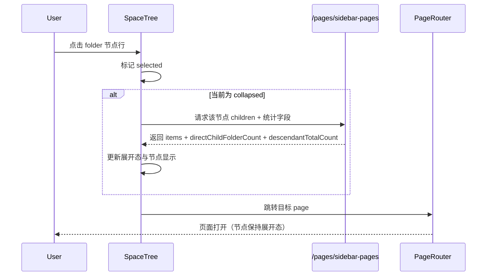
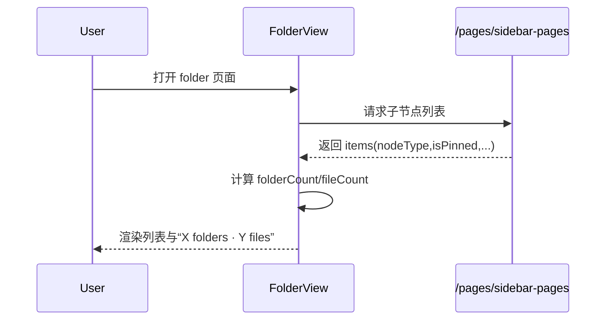

# 05 时序与状态机

**成文日期**：2026-02-20 00:46:36 UTC+8
**最后修订**：2026-02-20 02:57:28 UTC+8

本文档用于定义时序流程与状态流转规则。阅读时当前系统实现可能已发生变化，请以实际代码与产品行为为准，谨慎参考。

---

## 时序：侧边树节点点击（展开并进入页面）

## 时序：目录页加载与统计

## 状态机：树节点交互与操作区显隐

- `idle`：未 hover，操作区透明占位（不可点击）。
- `hover`：操作区显示并可交互。
- `selected`：操作区保持显示并可交互。
- `expanded`：节点展开（可与 `selected` 并存）。
- `editing`：进入重命名输入状态，图标与输入框保持同线对齐。

状态迁移：

- `idle -> hover`：鼠标进入节点。
- `hover -> idle`：鼠标离开且未选中。
- `hover -> selected`：点击节点行。
- `selected -> expanded`：点击 folder 节点行且此前未展开。
- `expanded -> selected`：箭头收起后保持选中。
- `selected -> editing`：触发重命名。
- `editing -> selected`：提交或取消重命名。

## 修改日志

- 2026-02-20 00:46:36 UTC+8：初始化文档骨架。
- 2026-02-20 00:49:31 UTC+8：补充目录统计与节点显隐时序。
- 2026-02-20 02:57:28 UTC+8：新增“点击节点展开并进入页面”时序，补充 expanded 状态定义。
