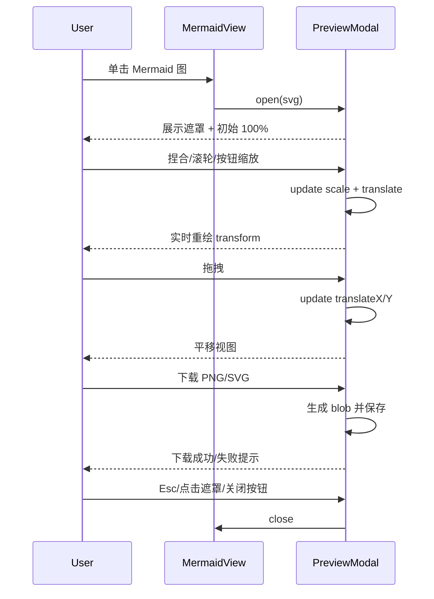
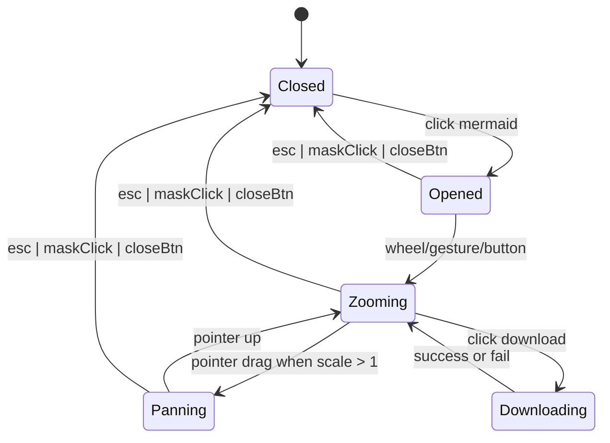

# 05 时序与状态机

**成文日期**：2026-02-28 15:07:59 UTC+8
**最后修订**：2026-02-28 15:07:59 UTC+8

本文档用于定义时序流程与状态流转规则。阅读时当前系统实现可能已发生变化，请以实际代码与产品行为为准，谨慎参考。

---

## 时序图：打开预览并交互

## 状态机：预览器

## 关键状态约束

1. `Closed` 进入 `Opened` 时，重置 `scale=1, translate=(0,0)`。
2. `scale <= 1` 时不允许进入 `Panning`。
3. 关闭动作优先级最高，任意状态均可直接关闭。
