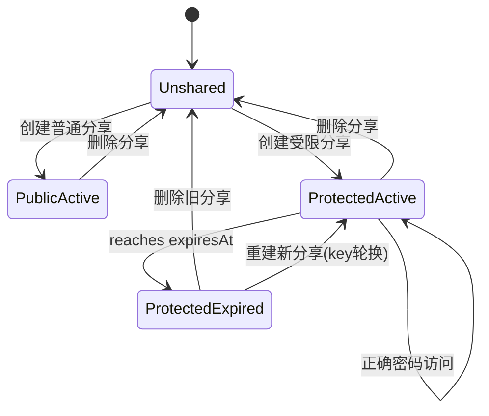
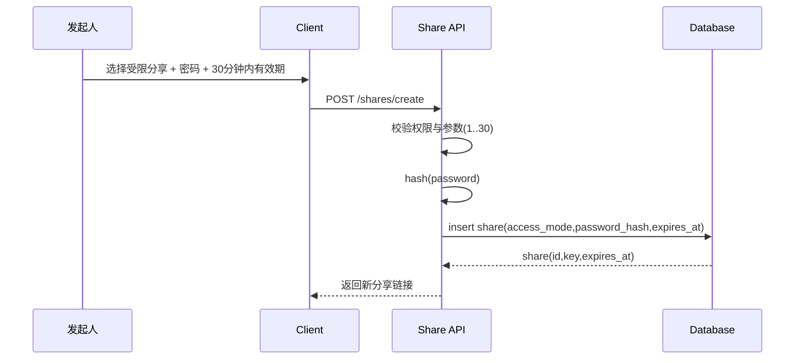
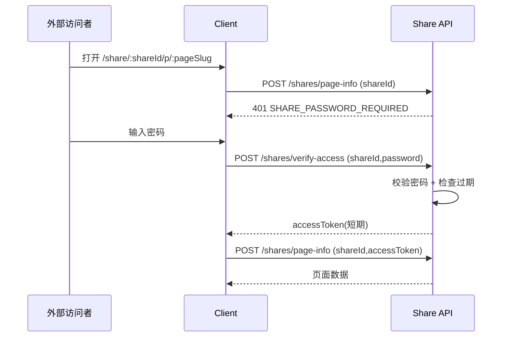
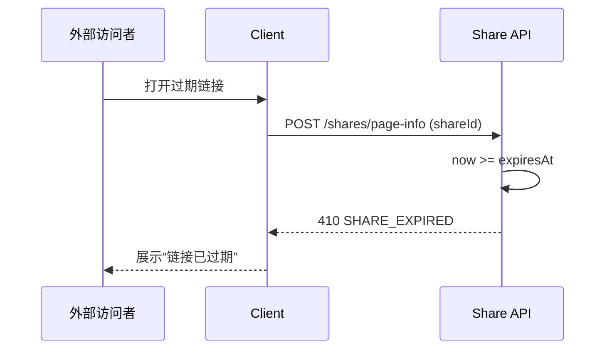
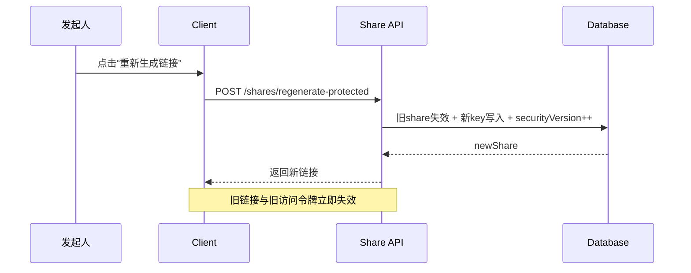

# 05 时序与状态机

**成文日期**：2026-03-04 22:50:29 UTC+8
**最后修订**：2026-03-04 22:51:34 UTC+8

本文档用于定义时序流程与状态流转规则。阅读时当前系统实现可能已发生变化，请以实际代码与产品行为为准，谨慎参考。

---

## 分享状态机

## 状态定义

| 状态 | 定义 | 可访问性 |
| --- | --- | --- |
| `Unshared` | 未分享 | 不可匿名访问 |
| `PublicActive` | 普通公开分享生效中 | 可匿名访问 |
| `ProtectedActive` | 受限分享生效中 | 需密码验证 + 未过期 |
| `ProtectedExpired` | 受限分享已过期 | 统一拒绝，提示已过期 |

## 时序 1：创建受限分享

## 时序 2：访问受限分享（成功）

## 时序 3：访问受限分享（已过期）

## 时序 4：重建受限分享

## 关键状态规则

1. `ProtectedExpired` 是只读终态，不能通过 update 接口恢复。
2. 子页面访问依赖同一 `shareId` 与父分享状态，不能独立续期。
3. 任何令牌验证都必须检查 `securityVersion`，避免重建后旧令牌可用。

## 修改日志

- 2026-03-04 22:50:29 UTC+8：初始化文档骨架。
- 2026-03-04 22:51:34 UTC+8：补充状态机定义与四条核心时序。
