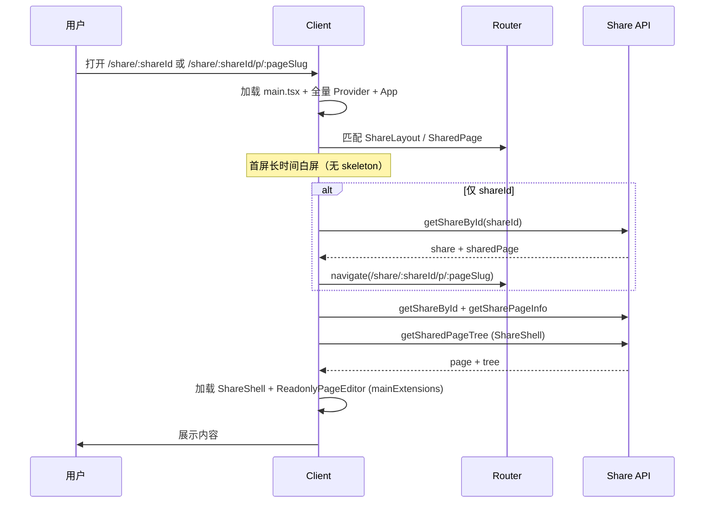
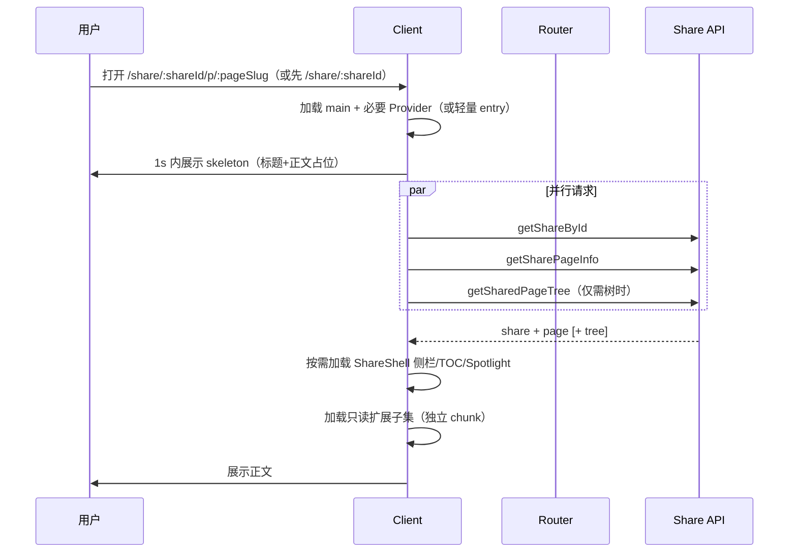
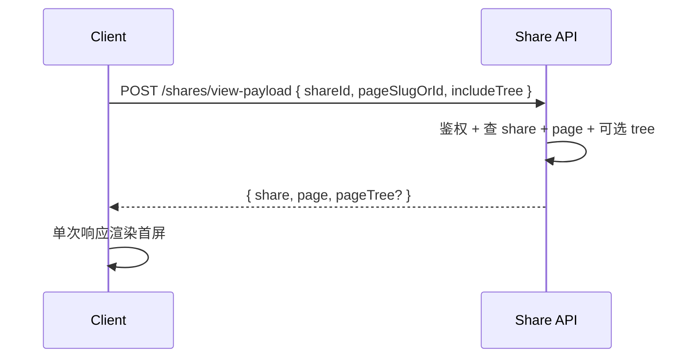

# 05 时序与状态机

**成文日期**：2026-03-05
**最后修订**：2026-03-05

本文档用于定义分享页加载时序与优化前后对比。阅读时当前系统实现可能已发生变化，请以实际代码与产品行为为准，谨慎参考。

---

## 状态说明

分享页无新增业务状态机；仅加载与渲染顺序发生变化。用户可见状态仍为：未加载（白屏/skeleton）→ 密码门禁（若需要）→ 内容展示 / 错误态。

## 时序 1：As-Is 分享页加载（当前）

- 问题：主 bundle 重、请求串行或重复、只读编辑器重、无首屏占位。

## 时序 2：To-Be 分享页加载（目标）

- 改进：skeleton 尽早、请求并行或合并、只读扩展独立 chunk、Shell 按需。

## 时序 3：可选合并接口

- 仅当后端实现合并接口时成立；前端需兼容「合并」与「现有多接口」两种模式（如通过 feature 或接口可用性检测）。

## 修改日志

- 2026-03-05：初稿，描述 As-Is / To-Be 加载时序与可选合并接口时序。
