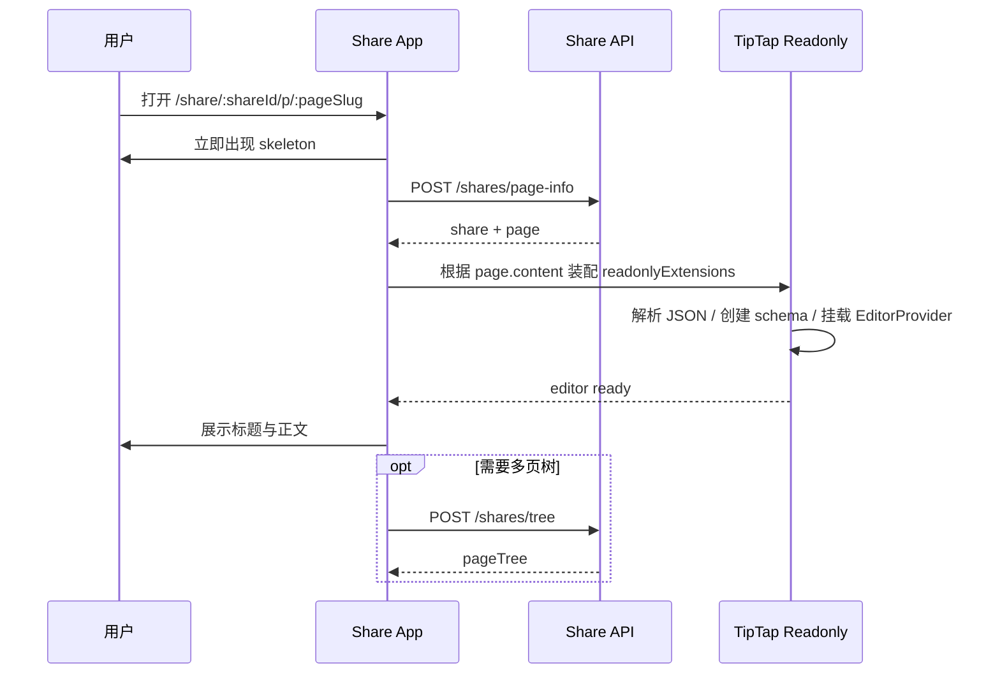
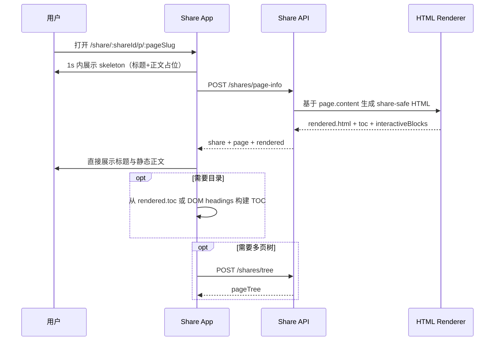
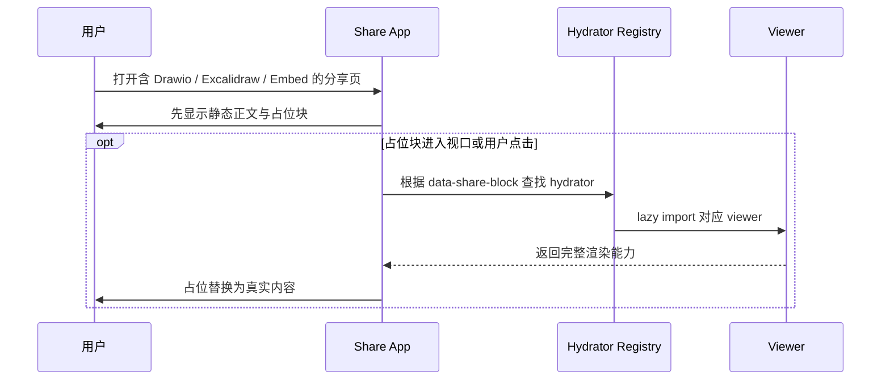
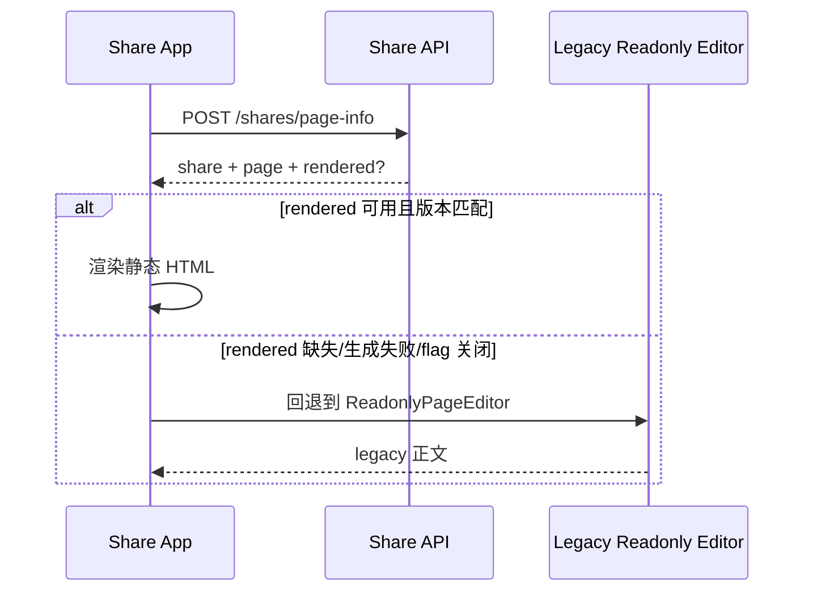
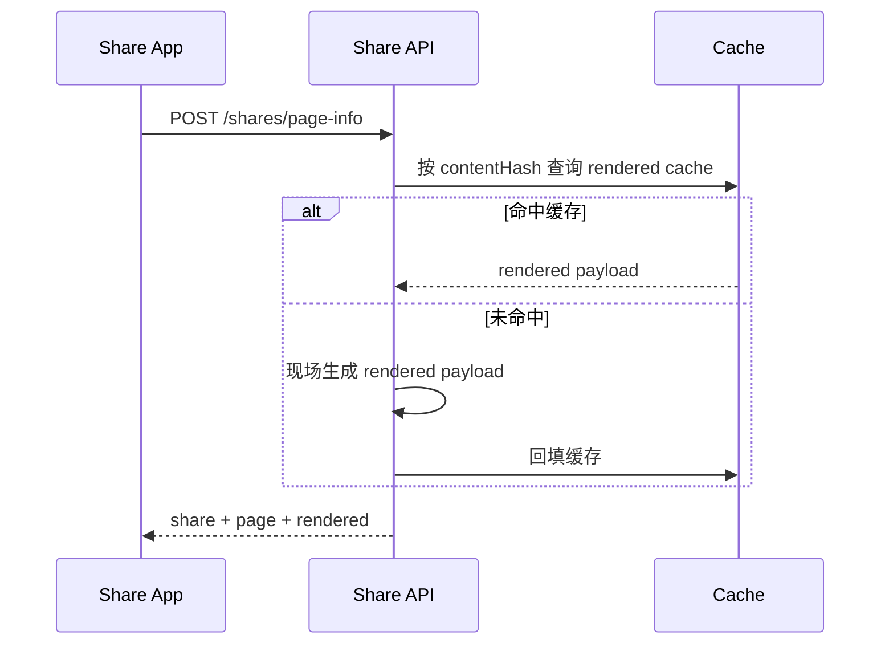

# 05 时序与状态机

**成文日期**：2026-03-05（历史初稿，精确时间未记录）
**最后修订**：2026-03-06 19:12:55 UTC+8

本文档用于定义分享页加载时序与优化前后对比。阅读时当前系统实现可能已发生变化，请以实际代码与产品行为为准，谨慎参考。

---

## 状态说明

分享页无新增业务状态机；变化的是“加载顺序”、“正文是否依赖编辑器运行时”以及“哪些能力可以后置”。用户可见状态调整为：

1. 进入分享页
2. 立即出现 skeleton
3. 标题与静态正文出现
4. 重内容与辅助能力渐进补齐
5. 若需要，再进入密码门禁 / 错误态 / 过期态

## 时序 1：当前真实基线（阶段一后）

- 问题总结：白屏已缓解，但正文出现仍被 TipTap 只读运行时绑定。

## 时序 2：目标架构（静态 HTML 主路径）

- 改进点：正文不再等待编辑器 ready；标题与首段正文能在 API 返回后直接可读。

## 时序 3：交互块渐进挂载

- 用户效果：先读正文，不再因为某个图表块把整页拖慢。

## 时序 4：静态 HTML fallback

- 说明：迁移期必须允许双路径并存，保证生产可回滚。

## 时序 5：可选补偿项

- 说明：只有当服务端生成耗时成为新瓶颈时，才进入 cache 补偿阶段。

## 修改日志

- 2026-03-06 19:12:55 UTC+8：将时序升级为“阶段一基线 + 阶段二静态 HTML 主路径”，补充 fallback 与 cache 补偿时序。
- 2026-03-06 15:56:17 UTC+8：按已确认取舍重写 To-Be 时序，新增重内容渐进加载时序，并弱化接口合并优先级。
- 2026-03-05：初稿，描述 As-Is / To-Be 加载时序与可选合并接口时序。
