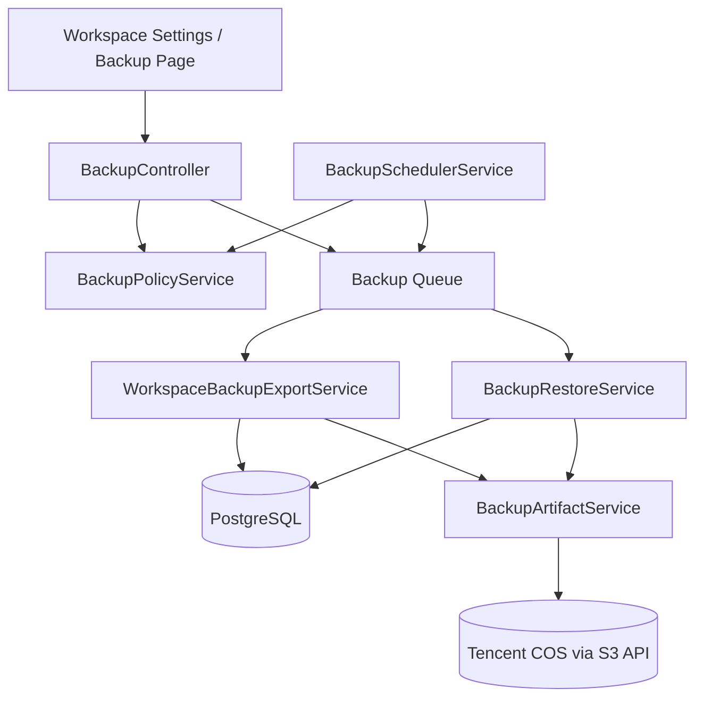

# 02 技术方案：架构与接口

**成文日期**：2026-03-08 13:41:35 UTC+8
**最后修订**：2026-03-08 18:37:30 UTC+8

本文档用于定义技术架构、接口契约与兼容策略。阅读时当前系统实现可能已发生变化，请以实际代码与产品行为为准，谨慎参考。

---

## 设计原则

1. 语义正确优先：工作区级备份不能继续沿用整库 `pg_dump` 语义。
2. 可恢复优先：备份成功不等于可恢复，V1 必须内置 dry-run。
3. 风险隔离优先：V1 只恢复到新工作区，不做原地覆盖。
4. 最小侵入：尽量复用现有 `backup_jobs`、队列、StorageService、权限与设置入口。
5. 多实例安全：调度不能依赖单节点内存态 Cron 注册。

## 总体架构

### 新增 / 调整模块

1. `BackupPolicyService`
   - 单工作区策略读取与保存
   - 预设频率编译
   - `nextRunAt` 计算
2. `BackupSchedulerService`
   - 固定周期扫描 due policy
   - 获取分布式锁
   - 生成 `schedule` 任务
3. `WorkspaceBackupExportService`
   - 按工作区逻辑导出数据域
   - 生成 manifest、checksum、summary
4. `BackupArtifactService`
   - 管理 COS / local 产物上传、下载、删除
5. `BackupRestoreService`
   - dry-run 校验
   - apply 恢复到新工作区
   - 恢复报告生成
6. `BackupController`
   - 策略接口
   - 作业接口
   - 上传与恢复接口
   - 恢复记录接口

### 复用能力

1. `StorageService`
   - COS/S3 上传、读取、签名下载
2. `QueueModule`
   - 异步执行备份与恢复
3. `WorkspaceAbilityFactory`
   - 当前工作区设置管理权限
4. `Import` 上传模式
   - 复用大文件上传与临时文件处理思路

## 核心技术决策

### 1. 备份产物格式采用逻辑快照，而不是 `pg_dump`

#### 原因

1. 工作区级范围需要按 `workspaceId` 导出，`pg_dump` 天生是物理/整表语义，不适合做租户级逻辑快照。
2. 恢复目标是“新工作区”，需要重写实体 ID 与部分引用，SQL dump 不利于安全映射。
3. 逻辑快照更容易明确 included / excluded 范围，也更适合做 dry-run 报告。

#### 结论

V1 工作区备份包采用 `tar.gz + manifest.json + data/*.ndjson + files/* + SHA256SUMS`。

### 2. 调度采用“固定轮询 + 分布式锁”，不采用“每工作区动态注册 Cron”

#### 原因

1. 当前服务可能是多实例部署，单实例动态 Cron 易重复触发。
2. 工作区数增长后，进程内注册大量 Cron 的可维护性差。
3. 固定轮询更利于灰度、观测、补偿与故障恢复。

#### 结论

新增每分钟轮询的 `BackupSchedulerService`：

1. 查询 `enabled=true` 且 `nextRunAt <= now()` 的策略
2. 使用 Redis / DB 锁避免重复 enqueue
3. 创建 `backup_jobs.triggerType=schedule`
4. 立即推进 `nextRunAt`

### 3. 恢复源只支持“成功作业”或“手工上传包”

#### 原因

1. 这样可以避免页面直接浏览任意 COS 历史对象，减少语义与审计混乱。
2. 对于管理员“下载到本地再恢复”的诉求，上传包即可满足。

## 运行时流程

### 备份流程

1. 页面保存策略到 `backup_policies`
2. 调度器轮询找到 due policy
3. 创建 `backup_jobs` 记录为 `pending`
4. Worker 抢到 workspace 级锁，转为 `running`
5. `WorkspaceBackupExportService` 导出逻辑数据、附件对象、manifest 和校验文件
6. `BackupArtifactService` 上传产物到 COS 或落地 local
7. 写回 `artifactPath`、`artifactSizeBytes`、`checksum`、`metadata`
8. 状态转为 `success` 或 `failed`
9. 执行保留策略清理

### 恢复流程

1. 用户选择成功作业或上传包
2. 发起 `dry-run`
3. 系统读取包，校验 manifest/schema/checksum
4. 输出 dry-run 报告：
   - 数据域摘要
   - 目标工作区名可用性
   - 用户映射结果
   - 将被跳过的数据域
5. 用户确认后发起 `apply`
6. 后端创建新工作区并逐步恢复数据
7. 任务成功后返回新工作区 ID 与报告

## 目标架构图（逻辑）



## 接口契约

### 1. 查询当前工作区备份策略

- `GET /backups/policy`

响应：

```json
{
  "enabled": true,
  "scheduleKind": "daily",
  "scheduleConfig": { "hour": 2, "minute": 0 },
  "timezone": "Asia/Shanghai",
  "retentionDays": 30,
  "retentionCount": 30,
  "targetDriver": "s3",
  "targetConfig": { "prefix": "backups/workspaces/<workspaceId>/" },
  "nextRunAt": "2026-03-09T02:00:00.000Z",
  "lastRunAt": "2026-03-08T02:00:05.000Z"
}
```

### 2. 保存当前工作区备份策略

- `PUT /backups/policy`

请求：

```json
{
  "enabled": true,
  "scheduleKind": "weekly",
  "scheduleConfig": {
    "weekday": 0,
    "hour": 2,
    "minute": 0
  },
  "timezone": "Asia/Shanghai",
  "retentionDays": 30,
  "retentionCount": 12
}
```

校验规则：

1. `scheduleKind` 仅允许 `daily | weekly | monthly`
2. 不开放原始 Cron 输入
3. `retentionDays` 与 `retentionCount` 至少一个非空

### 3. 手动触发备份

- `POST /backups/jobs/run`

请求：

```json
{}
```

响应：

```json
{
  "job": {
    "id": "uuid",
    "triggerType": "manual",
    "status": "pending"
  }
}
```

### 4. 查询备份作业列表

- `GET /backups/jobs?cursor=...&limit=20`

字段要求：

1. `status`
2. `triggerType`
3. `triggererName`
4. `startedAt`
5. `endedAt`
6. `artifactSizeBytes`
7. `checksum`
8. `errorMessage`
9. `metadata.summary`

### 5. 查询单个作业详情

- `GET /backups/jobs/:id`

补充字段：

1. `scopeType=workspace`
2. `packageFormatVersion`
3. `includedDomains`
4. `excludedDomains`

### 6. 获取下载链接

- `GET /backups/jobs/:id/download-url`

规则：

1. 仅 `success` 任务可下载
2. COS 场景返回短时效签名 URL
3. local 场景返回临时下载路由
4. 若备份产物已被删除，则返回 `BACKUP_ARTIFACT_NOT_FOUND` 或等价错误

### 6.1 删除历史备份产物

- `POST /backups/jobs/:id/delete-artifact`

请求：

```json
{
  "reason": "manual_cleanup"
}
```

规则：

1. 仅允许删除当前工作区 `success` 的历史备份
2. 不允许删除最后一份可用的成功备份
3. 不允许删除正在被恢复任务引用的备份
4. 删除时只删除产物与可下载性，不删除 job 记录本身

响应：

```json
{
  "jobId": "uuid",
  "artifactDeletedAt": "2026-03-08T10:37:30.000Z"
}
```

### 7. 上传恢复包

- `POST /backups/uploads`
- `multipart/form-data`

响应：

```json
{
  "uploadId": "file-task-id",
  "fileName": "workspace-backup.tar.gz",
  "fileSize": 123456789
}
```

说明：

1. V1 可复用 `file_tasks` 记录上传文件
2. 后端必须校验扩展名、大小与 checksum 文件是否存在

### 8. 发起恢复任务

- `POST /backups/restores`

请求：

```json
{
  "sourceType": "job",
  "jobId": "uuid",
  "mode": "dry-run",
  "targetWorkspaceName": "Recovered Workspace 2026-03-08"
}
```

或

```json
{
  "sourceType": "upload",
  "uploadId": "file-task-id",
  "mode": "apply",
  "targetWorkspaceName": "Recovered Workspace 2026-03-08"
}
```

规则：

1. `mode=apply` 前必须存在同源同目标名的成功 `dry-run`
2. `targetWorkspaceName` 必填
3. `sourceType=job` 时只允许使用当前工作区成功任务
4. 前端“恢复”按钮只负责打开恢复向导；只有显式调用 `POST /backups/restores` 且 `mode=apply` 时，后端才创建新工作区

### 9. 查询恢复记录

- `GET /backups/restores?cursor=...&limit=20`

输出字段：

1. `mode`
2. `status`
3. `sourceType`
4. `sourceJobId` / `uploadId`
5. `targetWorkspaceId`
6. `targetWorkspaceName`
7. `reportSummary`
8. `operatorName`

## 产物生命周期语义

1. `backup_jobs.status` 表示“备份执行结果”，不是“产物是否仍存在”。
2. 产物删除后：
   - `status` 仍保留为 `success`
   - 通过 `artifactDeletedAt` 等字段表达产物已不可用
   - UI 展示为“已删除”
3. retention 自动清理与手动删除共用同一套产物删除语义。

## 错误码建议

| 错误码 | 场景 | 含义 |
| --- | --- | --- |
| `BACKUP_POLICY_INVALID` | 保存策略 | 策略字段不合法 |
| `BACKUP_JOB_ALREADY_RUNNING` | 触发备份 | 当前工作区已有运行中备份 |
| `BACKUP_ARTIFACT_NOT_FOUND` | 下载/恢复 | 产物不存在或丢失 |
| `BACKUP_FORMAT_UNSUPPORTED` | 恢复 | 包格式版本不支持 |
| `BACKUP_DRY_RUN_REQUIRED` | 正式恢复 | 未先完成 dry-run |
| `BACKUP_RESTORE_TARGET_NAME_CONFLICT` | 恢复 | 目标工作区名冲突 |
| `BACKUP_RESTORE_SCOPE_MISMATCH` | 恢复 | 上传包不是工作区级格式 |

## 兼容与迁移策略

1. 当前手动作业查询接口可继续保留，但新作业默认使用 `scopeType=workspace`。
2. 旧格式整库打包产物不进入新恢复流程。
3. UI 若发现旧格式任务，只允许下载，不允许恢复。
4. 若未来保留实例级灾备，应拆分为独立入口与独立产物格式。

## 发布与灰度

1. 功能开关建议：
   - `workspace_backup_policy_enabled`
   - `workspace_backup_restore_enabled`
   - `workspace_backup_upload_restore_enabled`
2. 放量顺序：
   - 先启用策略与作业列表增强
   - 再启用 COS 产物
   - 最后启用恢复 dry-run / apply
