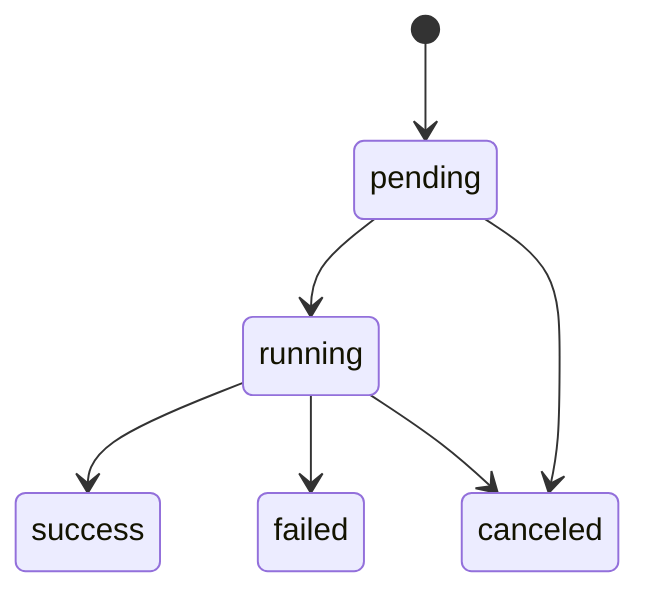
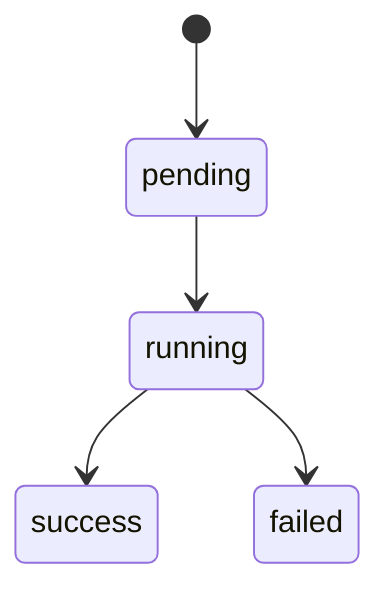
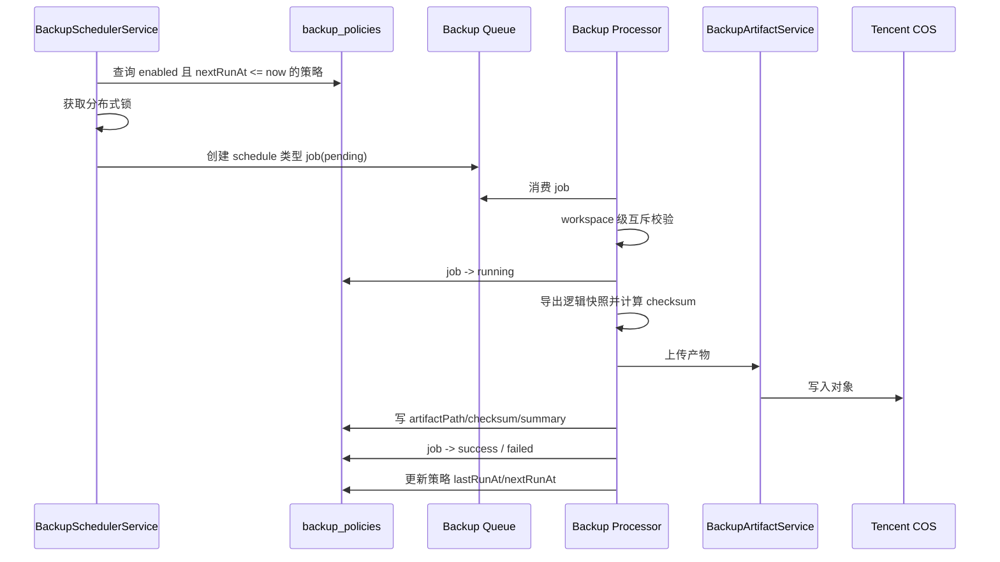
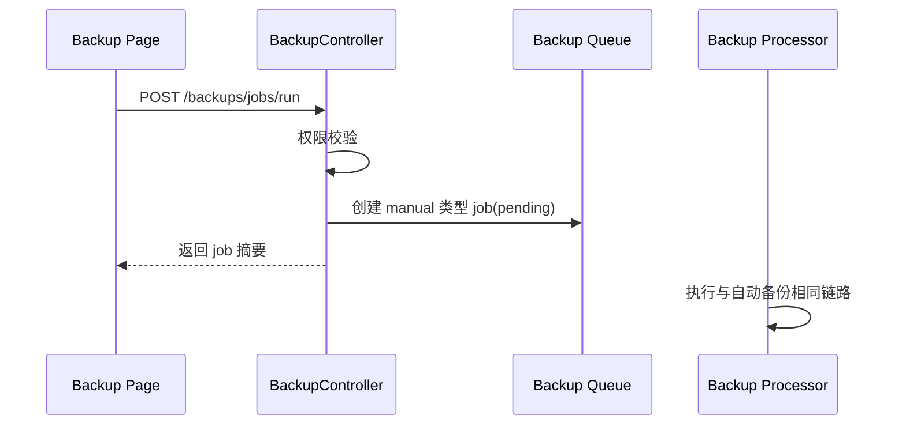
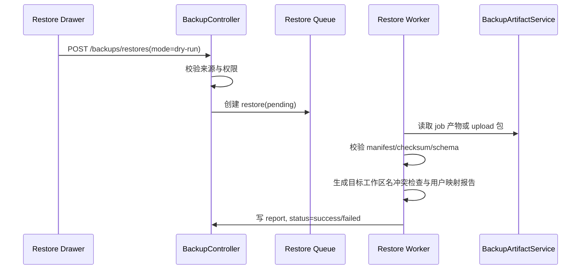
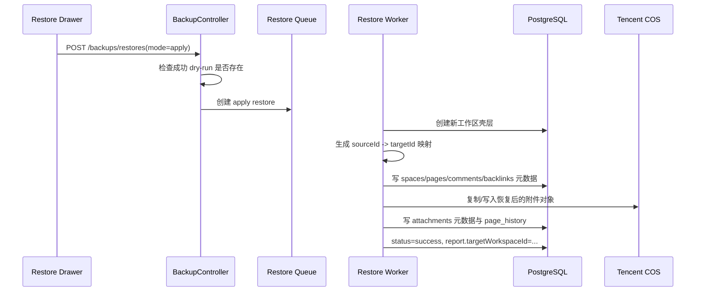

# 05 时序与状态机

**成文日期**：2026-03-08 13:41:35 UTC+8
**最后修订**：2026-03-08 13:41:35 UTC+8

本文档用于定义时序流程与状态流转规则。阅读时当前系统实现可能已发生变化，请以实际代码与产品行为为准，谨慎参考。

---

## 备份任务状态机

### 状态定义

| 状态 | 含义 |
| --- | --- |
| `pending` | 任务已创建，尚未被 worker 执行 |
| `running` | 任务正在导出数据、打包或上传 |
| `success` | 任务完成，产物可下载 / 可恢复 |
| `failed` | 任务失败，需展示错误摘要 |
| `canceled` | 任务被取消或被系统补偿终止 |

### 流转规则

### 关键约束

1. `pending/running` 状态的任务在 stale threshold 后必须被补偿为 `failed` 或 `canceled`。
2. `success` 任务才允许下载与恢复。

## 恢复任务状态机

### 状态定义

| 状态 | 含义 |
| --- | --- |
| `pending` | 恢复任务已创建，等待处理 |
| `running` | 正在做 dry-run 或 apply |
| `success` | dry-run 或 apply 成功 |
| `failed` | 校验或恢复执行失败 |

### 流转规则

### 模式约束

1. `mode=dry-run`：不落正式业务数据，只输出报告。
2. `mode=apply`：必须依赖同源成功 dry-run。

## 策略状态

| 状态 | 含义 |
| --- | --- |
| `enabled=true` | 策略参与调度扫描 |
| `enabled=false` | 策略存在但不参与调度 |

附加时钟字段：

1. `lastRunAt`
2. `lastSuccessAt`
3. `lastFailureAt`
4. `nextRunAt`

## 自动备份时序

## 手动备份时序

## dry-run 恢复时序

## apply 恢复时序

## 失败场景与状态约束

| 场景 | 规则 |
| --- | --- |
| 调度重复扫描同一策略 | 必须由锁与幂等 job key 去重 |
| 备份上传失败 | job -> `failed`，不得残留“成功但无产物”状态 |
| 上传恢复包损坏 | restore -> `failed`，报告写明 checksum / manifest 错误 |
| apply 中途失败 | restore -> `failed`，目标工作区标记为恢复失败并进入人工处理清单 |

## 关键状态一致性要求

1. UI、API、数据库中的备份状态枚举必须一致。
2. 手动与自动任务只允许 `triggerType` 不同，状态机完全一致。
3. 恢复记录必须独立于备份作业列表，但可引用来源 `jobId`。
