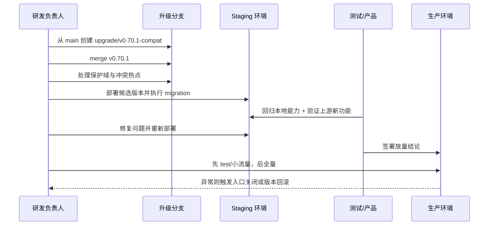

# 05 时序与状态机

**成文日期**：2026-03-08 20:57:06 UTC+8
**最后修订**：2026-03-08 20:58:36 UTC+8

本文档用于描述升级实施过程的时序、状态转换和失败分支。阅读时当前系统实现可能已发生变化，请以实际代码与产品行为为准，谨慎参考。

---

## 升级主时序

## 分支状态机

| 状态 | 进入条件 | 退出条件 | 失败回退 |
| --- | --- | --- | --- |
| `baseline_frozen` | 给当前 `main` 打标签 | 已建升级分支 | 回到 tagged baseline |
| `merge_in_progress` | 已 merge `v0.70.1` | 代码冲突已处理 | 重置升级分支到 baseline tag |
| `build_green` | install/build 通过 | migration 方案确定 | 修依赖或回退最近合并块 |
| `migration_green` | staging migration 成功 | 核心回归开始 | 停止发布，修迁移或回退 |
| `regression_green` | 本地能力与上游功能均通过 | 进入 test/prod 放量 | 关闭入口，回退候选版本 |
| `canary` | 低风险环境或小流量验证 | 指标稳定 | 版本回退 |
| `released` | 全量放量成功 | 进入后续维护阶段 | 按应急预案回退 |

## 模块启用状态机

| 模块 | 初始状态 | 中间状态 | 发布状态 |
| --- | --- | --- | --- |
| Notifications | not_present | merged_and_tested | enabled |
| Editor refresh | local_only | merged_with_local_toolbar | enabled |
| Page permissions | not_present | merged_but_gated | gated_or_enabled |
| Audit logs | not_present | merged_but_gated | gated_or_enabled |
| MCP / AI menu | not_present | merged_but_hidden | hidden_or_enabled |
| Backup | local_enabled | protected_during_upgrade | enabled |
| Share / WeChat | local_enabled | protected_and_patched | enabled |

## 关键同步点

1. `merge v0.70.1` 完成后必须立刻生成冲突清单。
2. 迁移整合完成后必须重新生成数据库类型。
3. client/server 编译通过后才能进 staging。
4. staging 回归通过后才能讨论 EE 功能是否放开入口。
5. 生产切换前必须再次确认回滚锚点可用。

## 失败分支

### 分支 A：编译失败

1. 优先看依赖锁文件、patch、类型定义冲突。
2. 不能在此阶段进入数据库演练。

### 分支 B：迁移失败

1. 停止继续放量。
2. 修复 migration 顺序或兼容逻辑。
3. 必要时回到 `build_green` 状态重新出包。

### 分支 C：回归失败

1. 若是本地能力回退，优先恢复保护域实现。
2. 若是上游新增功能故障，可临时 gate，不阻断整包升级。

### 分支 D：生产异常

1. 先关入口或隐藏功能。
2. 再回退版本。
3. 最后评估数据库补救。

## 修改日志

- 2026-03-08 20:58:36 UTC+8：补充升级主时序、分支状态机和失败分支。
