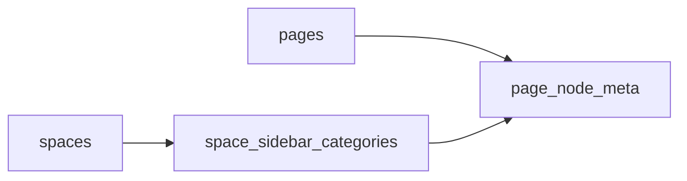

# 03 数据模型与存储设计

**成文日期**：2026-04-03 14:15:27 UTC+8
**最后修订**：2026-04-03 14:15:27 UTC+8

本文档用于定义表结构、索引、约束与迁移方案。阅读时当前系统实现可能已发生变化，请以实际代码与产品行为为准，谨慎参考。

---

## 设计目标

1. 不改 `pages` 主表，不让页面内容主实体承载导航分类。
2. 把“分类配置”和“节点归类”拆成两层：
   - Space 级配置表
   - 节点元数据关联字段
3. 保证旧数据零成本兼容：所有历史节点默认未分类。

## 新增表：`space_sidebar_categories`

| 字段 | 类型 | 约束 | 说明 |
|---|---|---|---|
| `id` | uuid | PK, default `gen_uuid_v7()` | 分类 ID |
| `workspace_id` | uuid | not null, FK | 工作区维度 |
| `space_id` | uuid | not null, FK | Space 维度 |
| `name` | varchar(24) | not null | 分类名称，建议前端限制 1-12 个可见字符 |
| `sort_key` | varchar | not null | 排序键，建议复用 fractional indexing |
| `created_by` | uuid | nullable FK | 创建人 |
| `created_at` | timestamptz | not null | 创建时间 |
| `updated_at` | timestamptz | not null | 更新时间 |

### 索引建议

- `space_sidebar_categories_space_sort_idx(space_id, sort_key)`
- `space_sidebar_categories_space_name_uidx(space_id, name)`

### 说明

- Phase 1 不做软删除，删除分类时直接删配置记录。
- 如后续需要审计恢复，再增加 `deleted_at`。

## 变更表：`page_node_meta`

### 新增字段

| 字段 | 类型 | 约束 | 说明 |
|---|---|---|---|
| `sidebar_category_id` | uuid | nullable, FK -> `space_sidebar_categories.id` `on delete set null` | 节点所属首级分类 |

### 索引建议

- `page_node_meta_space_category_idx(space_id, sidebar_category_id)`
- `page_node_meta_space_category_pin_idx(space_id, sidebar_category_id, is_pinned, pinned_at)`

## 服务端强约束

以下约束建议由 service 层保证，而不是试图在 DB 层通过跨表 check 完成：

1. 仅 `pages.parent_page_id is null` 的节点可设置 `sidebar_category_id`。
2. `page.space_id` 与 `category.space_id` 必须一致。
3. 子级节点一律视为 `sidebar_category_id = null`。
4. 根节点移动到某个父目录下时，自动清空 `sidebar_category_id`。
5. 根节点移动到其他 Space 时，自动清空 `sidebar_category_id`。
6. 复制根节点时：
   - 若复制结果仍在根级且同 Space，继承原分类
   - 否则不继承分类

## 数据关系图

## 典型数据示例

### 分类配置

| id | space_id | name | sort_key |
|---|---|---|---|
| `cat_01` | `space_a` | 创业 | `a0` |
| `cat_02` | `space_a` | 技术 | `a1` |

### 节点元数据

| page_id | parent_page_id | is_pinned | sidebar_category_id | 说明 |
|---|---|---|---|---|
| `p_root_1` | `null` | `true` | `cat_01` | 根节点，可见于“全部/置顶/创业” |
| `p_root_2` | `null` | `false` | `cat_02` | 根节点，可见于“全部/技术” |
| `p_child_1` | `p_root_1` | `true` | `null` | 子节点仍可置顶，但不进入分类 Tab 根集合 |

## 迁移方案

### DDL 步骤

1. 新建 `space_sidebar_categories`
2. 为 `page_node_meta` 增加 `sidebar_category_id`
3. 创建索引
4. 生成/更新 DB 类型定义

### 数据回填

- 不需要历史回填。
- 所有既有节点默认 `sidebar_category_id = null`。

### 上线顺序

1. 先发 DDL
2. 再发服务端接口与过滤逻辑
3. 最后发前端 Tab 与分类入口

### 回滚策略

- 若仅前端回滚：DB 可保留，分类数据不影响旧逻辑。
- 若服务端回滚：忽略 `sidebar_category_id` 相关逻辑即可。
- 不建议紧急 drop column/table，避免误删已写入的分类配置。

## 与现有模型的边界

| 能力 | 所属模型 | 说明 |
|---|---|---|
| 文档真实位置 | `pages.parent_page_id` | 真实目录结构唯一来源 |
| 置顶优先级 | `page_node_meta.is_pinned` | 优先级维度 |
| 侧边栏分类 | `page_node_meta.sidebar_category_id` + `space_sidebar_categories` | 首级导航视图维度 |
| 未来通用标签 | 新模型（后续） | 不复用本字段 |

## 修改日志

- 2026-04-03 14:15:27 UTC+8：完成分类配置表、节点分类字段与迁移方案设计。

