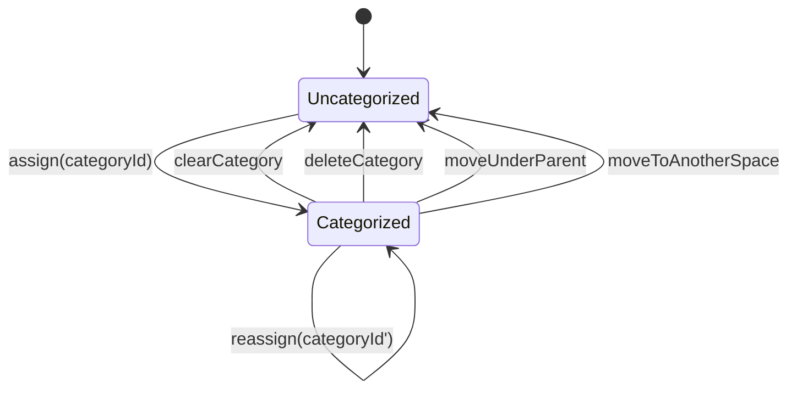
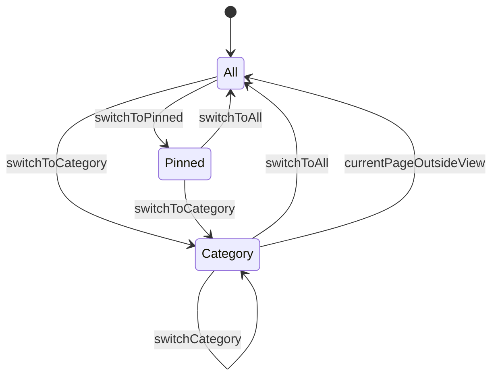
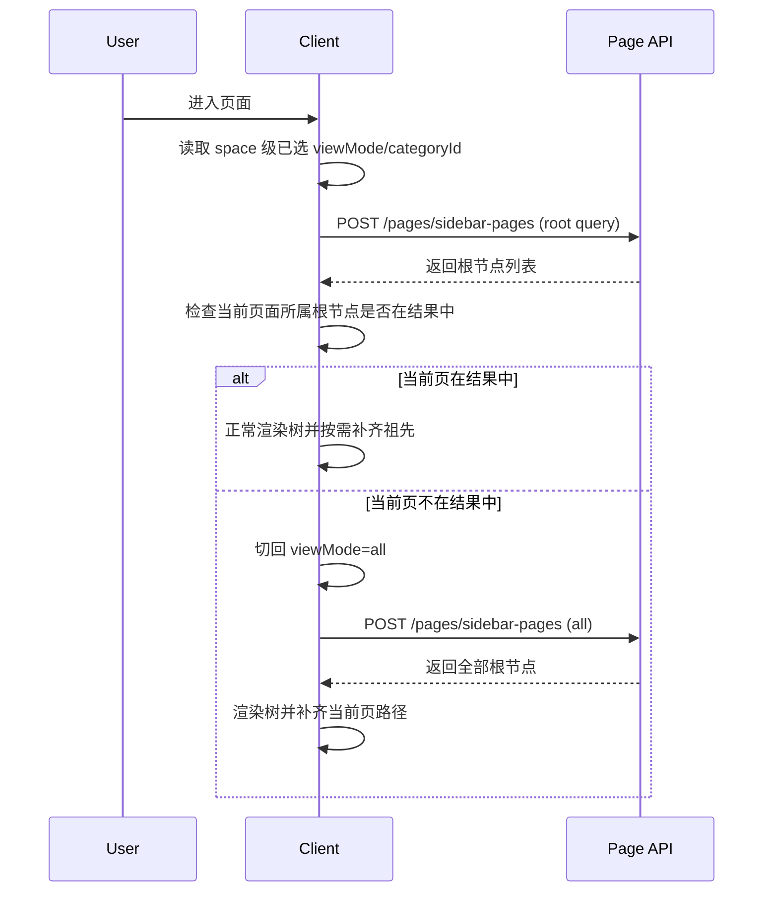
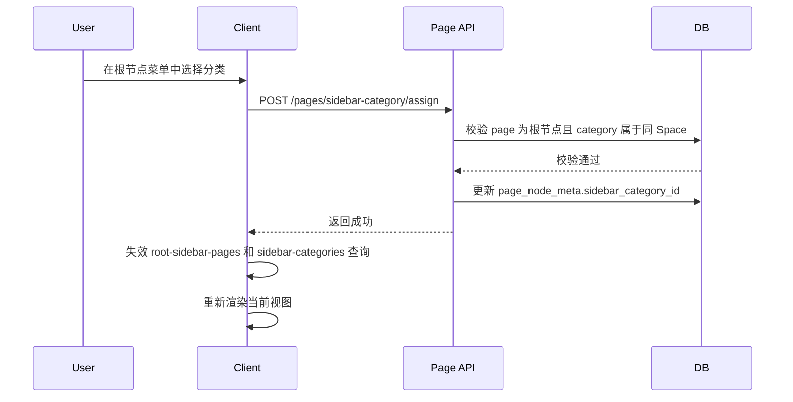
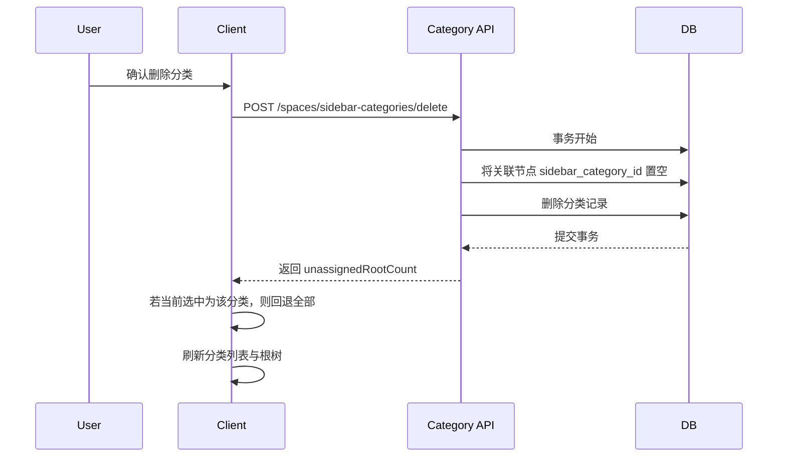
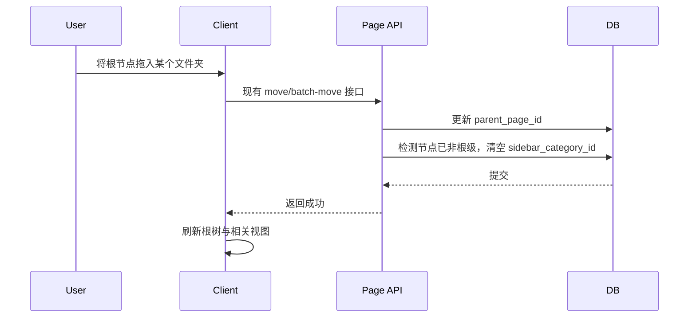

# 05 时序与状态机

**成文日期**：2026-04-03 14:15:27 UTC+8
**最后修订**：2026-04-03 14:15:27 UTC+8

本文档用于定义关键交互时序与核心状态转换。阅读时当前系统实现可能已发生变化，请以实际代码与产品行为为准，谨慎参考。

---

## 状态模型 1：节点分类状态

### 说明

- `Categorized` 仅允许存在于首级节点。
- 一旦节点失去首级身份，必须回到 `Uncategorized`。

## 状态模型 2：侧边栏视图状态

### 说明

- `Pinned` 与 `Category` 都只是根视图过滤态。
- `currentPageOutsideView` 是本期关键保护分支，不能省略。

## 时序 1：打开页面并加载侧边树

## 时序 2：给首级节点设置分类

## 时序 3：删除分类

## 时序 4：根节点移动导致分类失效

## 状态与时序结论

1. 本期最关键的状态边界是“首级/非首级”。
2. 本期最关键的时序保护是“当前页不在当前视图时切回全部”。
3. 只要这两条规则被稳定执行，分类 Tab 就能与现有树模型共存。

## 修改日志

- 2026-04-03 14:15:27 UTC+8：完成分类状态、视图状态与关键交互时序设计。

