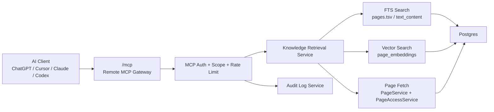

# 02 技术方案：架构与接口

**成文日期**：2026-04-08 13:46:11 UTC+8
**最后修订**：2026-04-26 23:58:22 UTC+8

本文档用于定义技术架构、接口契约与兼容策略。阅读时当前系统实现可能已发生变化，请以实际代码与产品行为为准，谨慎参考。

---

## 总体架构

本专题采用四层架构：

1. Source of Truth 层：现有 `pages`、`attachments`、`comments`、`spaces`、权限与审计体系。
2. Retrieval 层：负责 chunk 化、embedding、关键词召回、向量召回、ACL 过滤与结果整形。
3. Protocol Adapter 层：把 retrieval 能力封装成 remote MCP `search/fetch` 工具。
4. Governance 层：负责 Token、scope、限流、审计与开关控制。

### 架构图

## 架构原则

1. 协议层薄：MCP 只负责协议握手、工具定义、参数校验、返回格式与治理，不重写业务逻辑。
2. 检索层厚：AI 体验差异主要由检索质量决定，因此检索编排应独立成服务。
3. 权限前置：先做 ACL 过滤，再做结果返回与正文抓取，避免“搜得到但读不到”的泄露。
4. 只读优先：首期所有 MCP 工具默认 `readOnlyHint=true`，不引入写操作审批。
5. 兼容未来：接口设计首期兼容 Bearer Token，后续可平滑升级到 OAuth 兼容授权。

## 传输与部署

1. 入口路径：`/mcp`
2. 传输方式：remote MCP over HTTP
3. 部署位置：与主应用同域部署，依赖现有 `DomainMiddleware` 识别工作区
4. 兼容说明：
   - 首期以通用 remote MCP 为目标
   - 为兼容深度研究类客户端，至少要实现 `search` 与 `fetch`
   - 保留未来扩展更多工具的能力，但不要求首期一次性全开

## 认证与授权

### 首期方案

1. 使用现有 Bearer API Key。
2. `/mcp` 请求走现有 JWT / API Key 校验逻辑。
3. 在 Token 维度增加 scope 语义，默认只发放 `knowledge.read`。
4. 工具执行前统一校验：
   - workspace `mcpEnabled`
   - token 有效性
   - token scope
   - 页面/空间 ACL

### 后续方案

1. 引入 OAuth 兼容的 remote MCP 授权。
2. 在保留本地 Token 的同时，支持标准授权流。
3. 对写工具增加审批与更细颗粒 scope。

## 核心模块设计

### 1. MCP Gateway Module

- 职责：
  - 暴露 `/mcp`
  - 注册工具清单
  - 执行输入 schema 校验
  - 输出 structured tool result
- 不负责：
  - 检索算法
  - 页面权限判断细节
  - 页面写入业务逻辑

### 2. Knowledge Retrieval Service

- 职责：
  - query 预处理
  - FTS 召回
  - 向量召回
  - 融合排序
  - ACL 过滤
  - snippet 生成
  - fetch 正文格式化
- 不负责：
  - Token 创建与撤销
  - 工作区配置修改

### 3. Token Governance Extension

- 职责：
  - Token scope 解释
  - 最近使用时间/IP 更新
  - MCP 限流与配额
  - 工具调用审计

### 4. Indexing/Embedding Pipeline

- 职责：
  - 页面正文分块
  - 嵌入向量生成
  - 内容 hash 比对
  - 增量更新
- 复用：
  - 现有 `page_embeddings`
  - 现有 AI queue 常量

## Tool 设计

### Phase 1 必选工具

#### `search`

- 目标：根据自然语言问题返回候选文档/分块结果
- 输入：
  - `query: string`
  - `space_id?: string`
  - `parent_page_id?: string`
  - `include_children?: boolean`
  - `max_depth?: number`
  - `top_k?: number`
  - `source_types?: string[]`
- 输出：
  - `items[]`
    - `id`
    - `title`
    - `snippet`
    - `page_id`
    - `space_id`
    - `score`
    - `updated_at`
    - `url`

#### `fetch`

- 目标：根据 `search` 返回的 `id` 获取正文及附件信息
- 输入：
  - `id: string`
  - `format?: "markdown" | "html"`
  - `mode?: "snippet" | "section" | "full"`
  - `max_tokens?: number`
  - `include_images?: "none" | "metadata" | "url" | "inline"`
  - `include_children?: boolean`
  - `max_depth?: number`
- 输出：
  - `id`
  - `page_id`
  - `title`
  - `content`
  - `format`
  - `updated_at`
  - `url`
  - `metadata`
  - `attachments[]`（Phase 1 新增，仅图片类型）
    - `id`
    - `name`
    - `mime_type`
    - `file_size`
    - `url?`（仅在 `include_images="url"` 或 `include_images="inline"` fallback 时返回，权限与页面访问权限一致）
    - `width?`
    - `height?`

**Phase 2 升级说明**：当 AI 客户端支持且图片尺寸在阈值以内时，`attachments` 中的图片可升级为 MCP 标准 `image` content block（base64 编码），实现单次工具调用内的多模态内容返回。超大图片保留 URL fallback。

### 读取范围与 Token 治理

AI 客户端不得默认整库遍历或整树读取。工具调用应遵循“先定位、再读取、按需扩展”的渐进式策略：

1. `search` 负责定位候选文档、分块、附件或评论，默认只返回短片段和定位信息，不返回正文全文。
2. `fetch` 负责读取指定结果，默认返回命中段落附近内容，而不是整篇文档。
3. 下级页面/文件夹读取必须显式开启：`include_children=true` 时才包含子页面，并且必须受 `max_depth` 限制。
4. 图片默认不内联：`include_images` 默认值为 `metadata`，仅返回图片数量、类型、尺寸与可选 URL；只有客户端明确请求且能力兼容时才允许 `inline`。
5. 所有返回正文必须受 `max_tokens` 或服务端硬上限约束，防止长文档、深层目录和多图页面造成上下文爆炸。

建议默认值：

| 参数 | 默认值 | 说明 |
| --- | --- | --- |
| `search.top_k` | `8` | 控制候选结果数量 |
| `search.include_children` | `false` | 不默认递归子页面 |
| `search.max_depth` | `0` | 仅在 `include_children=true` 时生效 |
| `fetch.mode` | `section` | 返回命中上下文附近内容 |
| `fetch.max_tokens` | `3000` | 可由服务端按模型与部署策略进一步收紧 |
| `fetch.include_images` | `metadata` | 默认不返回图片 URL 或 base64 |
| `fetch.include_children` | `false` | 不默认读取子页面 |
| `fetch.max_depth` | `0` | 仅在 `include_children=true` 时生效 |

行为约束：

1. 如果用户明确要求“总结某文件夹/包含下级文档”，AI 才应传入 `parent_page_id + include_children=true + max_depth`。
2. 服务端必须对递归结果逐页执行 ACL 过滤，不能因父页面可见而默认暴露所有子页面。
3. `full` 模式仅适合短文档或用户明确要求全文审查；长文档必须分段返回或提示缩小范围。
4. `inline` 图片模式必须有大小阈值，建议首期不超过 1MB，超限回退 URL 或 metadata。

### Phase 1 可选工具

1. `get_page_markdown(page_id)`
2. `list_spaces()`
3. `get_current_user()`

### Phase 2 写工具候选

1. `create_page`
2. `update_page`
3. `create_comment`

首期不实现这些写工具，只保留路标。

## 图片处理策略

### 图片来源分类

| 类型 | 处理方式 | 返回位置 |
| --- | --- | --- |
| 页面附件（PNG/JPG/GIF 等） | Phase 1：返回 URL；Phase 2：升级为 base64 content block | `fetch.attachments[]` |
| Mermaid / PlantUML 图表 | 返回原始源码，AI 直接理解语义，无需渲染 | 随 `fetch.content`（Markdown code fence）自然携带 |
| 富文本表格/卡片 | Markdown 序列化覆盖 | 随 `fetch.content` 携带 |
| 页面整页截图 | **不做** | 非目标 |

### Phase 1：附件图片 metadata / URL

- `attachments[]` 字段仅包含 `image/*` MIME 类型的附件。
- `include_images="metadata"` 仅返回图片附件元数据，不返回 URL 或 base64。
- `include_images="url"` 时，URL 指向现有附件服务（`/files/by-id/:id`），权限模型复用页面访问权限，不额外开放。
- AI 客户端需要自行携带 Bearer Token 请求图片 URL（与主 MCP Token 相同凭证）。

### Phase 2：MCP content block 内联图片

- 升级条件：图片文件大小 <= 阈值（建议 1MB），且 AI 客户端声明支持 `image` content block。
- 超出阈值的图片回退到 URL 模式。
- 不做服务端 OCR 或图片描述生成，由 AI 客户端的视觉能力自行处理。

## 检索流程

1. 客户端调用 `search(query)`
2. Gateway 做 schema + auth + scope 校验
3. Retrieval Service 执行：
   - 关键词召回
   - 向量召回
   - 结果融合
   - ACL 过滤
   - snippet 生成
4. 客户端基于结果调用 `fetch(id)`
5. Gateway 校验 `id` 合法性与访问权限
6. Retrieval Service 按 `mode/max_tokens/include_images/include_children/max_depth` 取正文并输出 Markdown 与附件信息

## 与现有服务的映射

| 能力 | 复用对象 | 说明 |
| --- | --- | --- |
| Token 验证 | `IntegrationTokenService` + `JwtStrategy` | 沿用现有 API Key 校验 |
| 页面正文读取 | `PageService` / `PageAccessService` | 复用现有 `pages/info` 所依赖的业务逻辑 |
| 搜索 | `SearchService` | 复用 FTS 召回，新增 hybrid 编排 |
| 审计 | `AuditLogService` | 复用现有审计模块，新增工具事件 |
| 工作区识别 | `DomainMiddleware` | 复用当前 self-hosted/cloud 的工作区解析 |

## 接口契约

### 外部协议契约

| api_id | operation_id | domain_id | step_no | source_router_service | authz | idempotency | 跨模块联动约束 | error_code | 恢复路径 |
| --- | --- | --- | --- | --- | --- | --- | --- | --- | --- |
| API-001 | OP-002 | DOMAIN-MCP-GATEWAY | 1 | `/mcp search` -> `knowledgeRetrievalService.search` | token + scope + ACL | read_only | 关闭开关、scope 缺失、空间无权均需阻断 | `MCP_DISABLED` / `MCP_SCOPE_DENIED` / `MCP_PAGE_FORBIDDEN` | 改问、补权、重建 Token |
| API-002 | OP-002 | DOMAIN-MCP-GATEWAY | 2 | `/mcp fetch` -> `knowledgeRetrievalService.fetch` | token + scope + ACL | read_only | `search` 命中不代表可取正文，`fetch` 需再校验 | `MCP_DOCUMENT_NOT_FOUND` / `MCP_PAGE_FORBIDDEN` | 改选其他结果 |
| API-003 | OP-001 | DOMAIN-TOKEN-GOVERNANCE | 1 | `POST /integration-keys/create` | 登录态 + workspace policy | idempotent_by_user_intent | 若 `restrictToAdmins=true` 必须拒绝普通成员 | `FORBIDDEN` | 管理员调整策略 |
| API-004 | OP-003 | DOMAIN-TOKEN-GOVERNANCE | 1 | `POST /integration-keys/revoke` | 登录态 + ownership/admin | idempotent | 撤销后 `/mcp` 立即失效 | `FORBIDDEN` / `TOKEN_NOT_FOUND` | 重新创建新 Token |

### 外部错误码建议

| 错误码 | 含义 | 客户端动作 |
| --- | --- | --- |
| `MCP_DISABLED` | 工作区未开启 MCP | 提示联系管理员开启 |
| `MCP_SCOPE_DENIED` | 当前 Token 不具备目标工具 scope | 提示换用更高权限 Token |
| `MCP_PAGE_FORBIDDEN` | 页面或空间无访问权限 | 提示用户确认权限 |
| `MCP_DOCUMENT_NOT_FOUND` | 文档不存在、已删除或 `id` 无效 | 建议重新搜索 |
| `MCP_RATE_LIMITED` | 超出配额 | 客户端退避重试 |

## 领域边界与服务拆分（详细版）

| domain_id | domain_goal | primary_entities | frontend_routes | backend_router | backend_service | allowed_commands | read_models | out_of_scope | split_trigger |
| --- | --- | --- | --- | --- | --- | --- | --- | --- | --- |
| DOMAIN-MCP-GATEWAY | 协议适配、工具定义、参数校验 | mcp_session、tool_call | `/settings/ai/mcp` | `mcpRouter` | `mcpGatewayService` | `search`、`fetch` | tool_manifest | 内容索引、页面写入 | 当工具数 >= 6 或引入写链路时拆分只读/写 handler |
| DOMAIN-KNOWLEDGE-RETRIEVAL | 检索与正文抓取 | page、chunk、embedding | 无新增页 | `knowledgeRetrievalRouter` | `knowledgeRetrievalService` | search_content、fetch_content | retrieval_result、page_markdown | Token 管理 | 当接入 comments/attachments 独立检索策略时拆子域 |
| DOMAIN-KNOWLEDGE-INDEX | 索引与向量更新 | embedding_job、content_chunk | 无新增页 | `knowledgeIndexRouter` | `knowledgeIndexService` | chunk_page、embed_page、sync_page | chunk_status | MCP 协议与外部连接 | 当引入多模型 embedding 时拆 model 管理子域 |
| DOMAIN-TOKEN-GOVERNANCE | Token 与配额治理 | api_token、token_scope | `/settings/account/api-keys`、`/settings/api-keys` | `integrationTokenRouter` | `integrationTokenService` | create_token、revoke_token、check_scope | token_usage | 检索算法 | 当 OAuth 上线时拆 authz 子域 |

## 兼容策略

1. 与现有 Web 搜索兼容：不替换 Web 搜索入口，MCP 仅新增 AI 调用面。
2. 与现有 Token 兼容：旧 Token 可按默认只读 scope 兼容迁移。
3. 与现有工作区配置兼容：继续使用 `workspace.settings.ai.search` 与 `workspace.settings.ai.mcp`。
4. 与未来 OAuth 兼容：协议层独立，后续只替换 auth provider，不替换工具实现。
