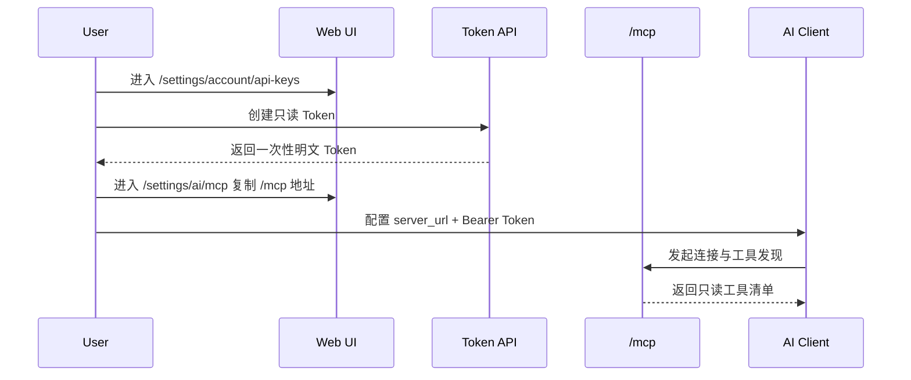
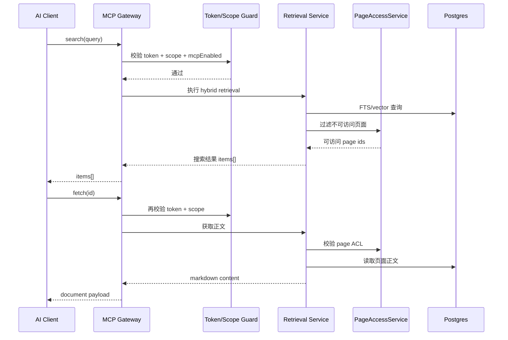
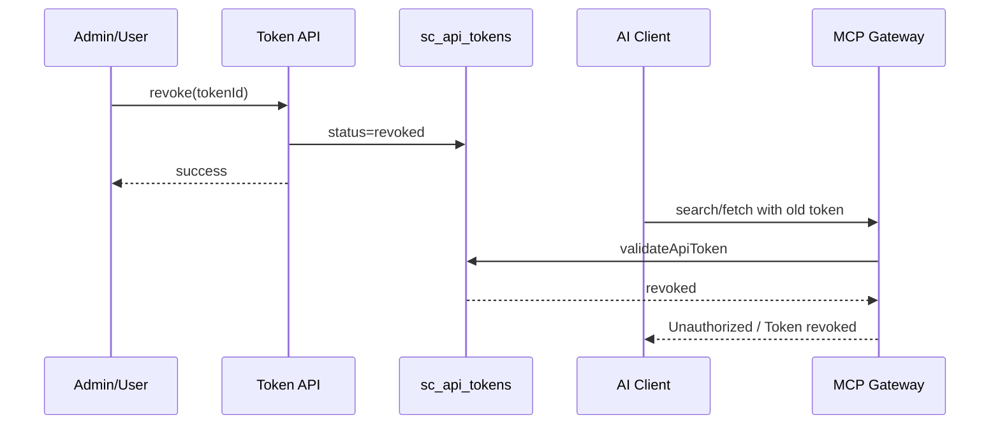
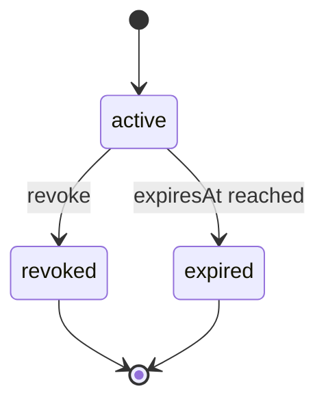
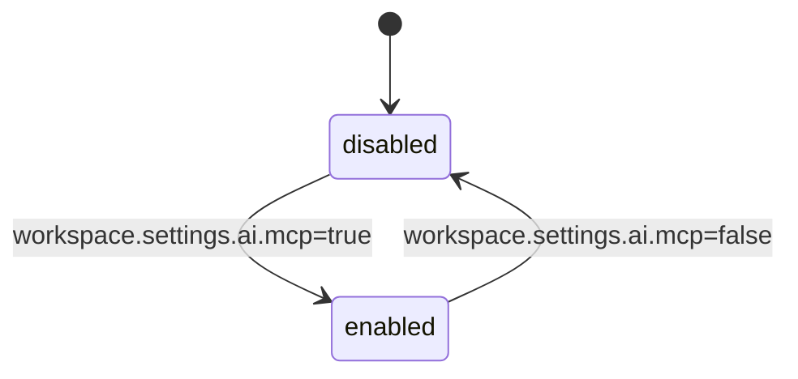
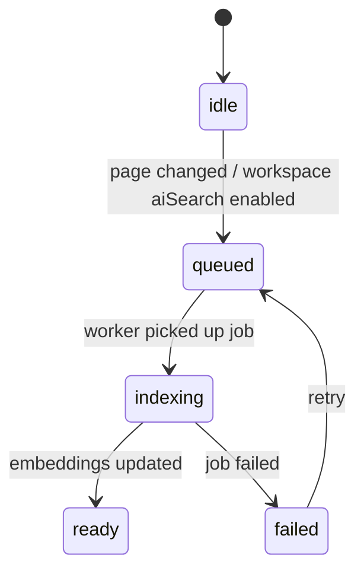

# 05 时序与状态机

**成文日期**：2026-04-08 13:46:11 UTC+8
**最后修订**：2026-04-08 13:46:11 UTC+8

本文档用于定义时序流程与状态流转规则。阅读时当前系统实现可能已发生变化，请以实际代码与产品行为为准，谨慎参考。

---

## 时序 1：连接外部 AI 客户端

## 时序 2：AI 先搜索再抓正文

## 时序 3：撤销 Token 后阻断 AI 调用

## 状态机 1：Token 生命周期

## 状态机 2：MCP 能力开关

## 状态机 3：索引同步

## 关键状态规则

1. `mcpEnabled=false` 时，不允许任何工具调用进入执行态。
2. `token.status=revoked` 或 `expiresAt < now` 时，调用必须立即失败。
3. `search` 返回命中不代表 `fetch` 一定成功，`fetch` 必须二次 ACL 校验。
4. 索引失败不应阻断页面正常读写，但会降低 AI 检索质量。
