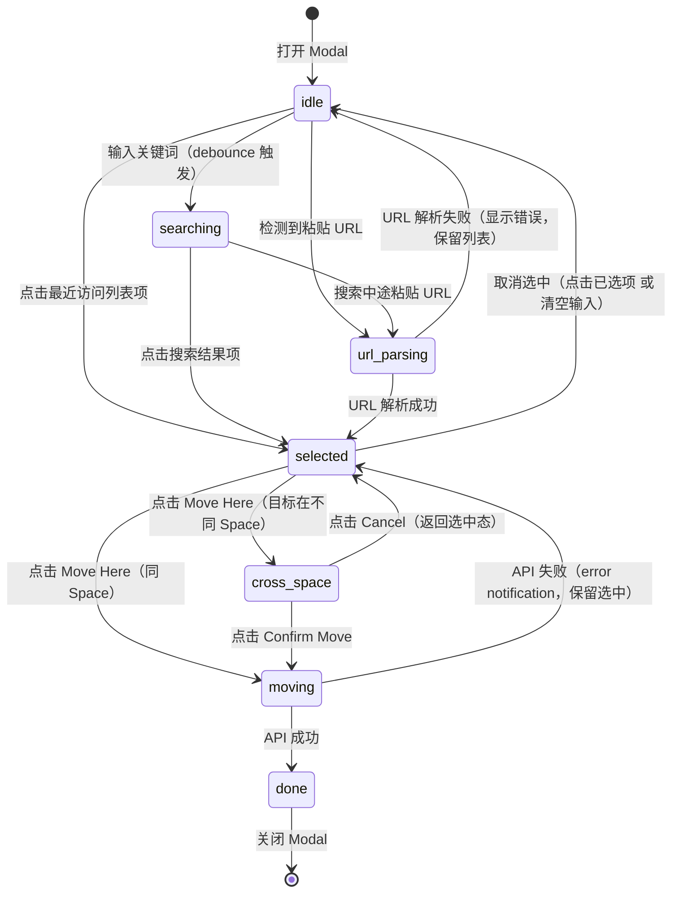
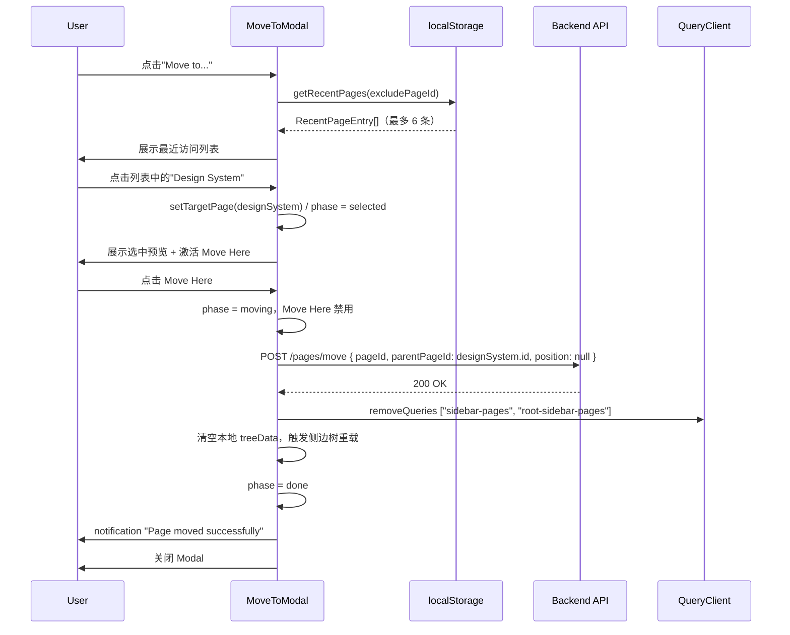
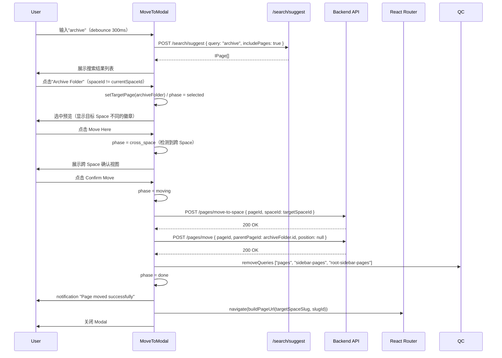
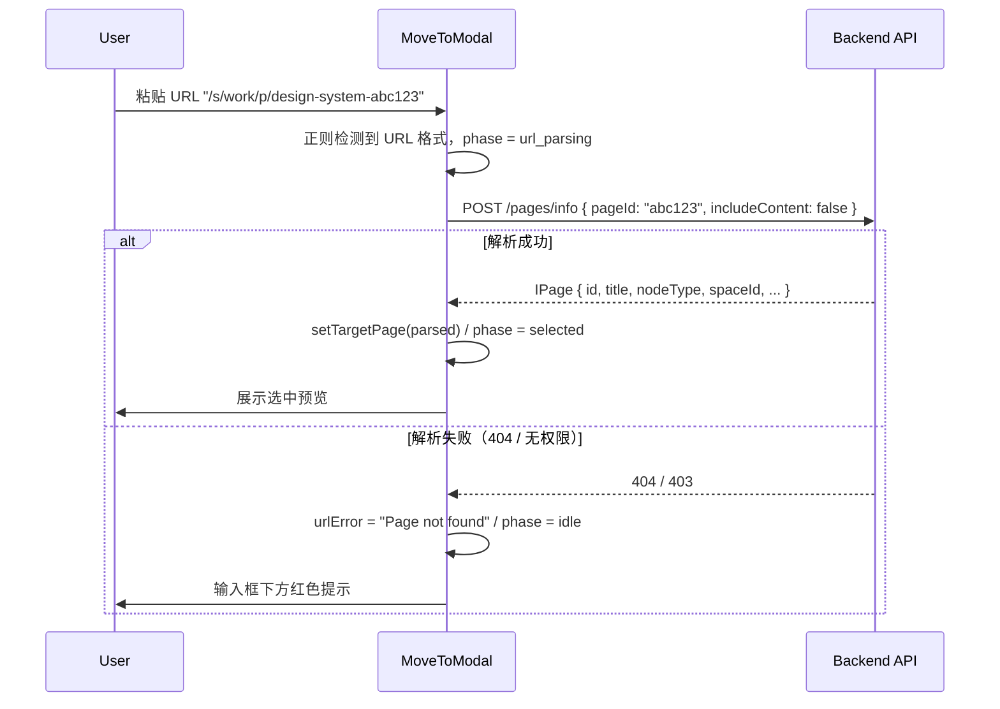
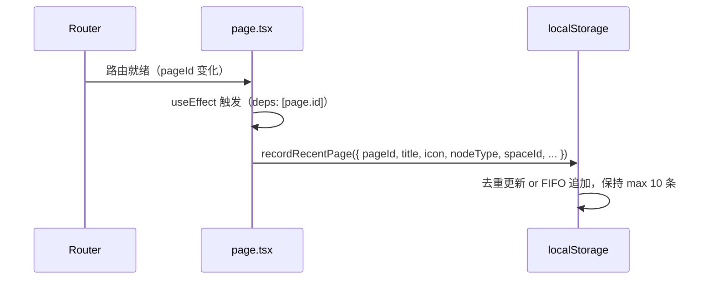

# 05 时序与状态机

**成文日期**：2026-04-20 12:08:54 UTC+8
**最后修订**：2026-04-20 12:08:54 UTC+8

本文档用于定义关键交互时序与核心状态转换。**阅读时当前系统实现可能已发生变化，请以实际代码与产品行为为准，谨慎参考。**

---

## 状态模型：MoveToModal Phase



---

## 时序 1：打开弹窗 → 选择最近访问 → 同 Space 移动



---

## 时序 2：搜索 → 选择 → 跨 Space 移动



---

## 时序 3：粘贴 URL → 解析 → 移动



---

## 时序 4：页面访问时记录最近访问



---

## 边界情况时序

### Case A：移动失败回退

```
moving → API 返回 4xx/5xx
  → phase 回退到 selected（保留 targetPage）
  → 展示 error notification
  → Move Here 按钮重新激活（用户可重试）
```

### Case B：跨 Space 移动第一步成功、第二步失败

```
POST /pages/move-to-space → 200
POST /pages/move → 500
  → 展示 notification:"Moved to space but failed to set location.
     Page is now at root of {{spaceName}}."
  → 清空 queryClient 缓存（因为 spaceId 已变更）
  → navigate 到目标 Space
  → 关闭 Modal（phase = done）
  → 用户可在目标 Space 中找到页面并再次移动
```

### Case C：Modal 关闭时未完成移动

```
moving 状态下用户关闭 Modal（点 × 或 Esc）
  → Modal 忽略关闭操作（moving 期间 Modal.Root closeOnEscape=false, closeOnClickOutside=false）
  → 移动完成后自动关闭
```

---

## 修改日志

- 2026-04-20：完成首版时序与状态机。
